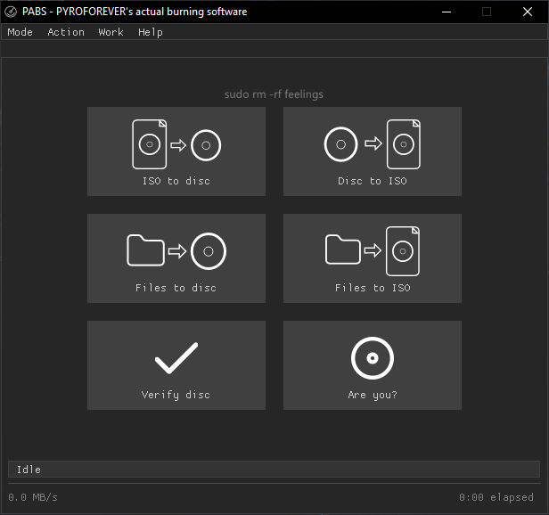

# **PABS - PYROFOREVER's actual burning software**
Burning software made in **C++** with `IMAPIv2`, `ImGui` *(**DX11** based)*, no bloatware or adware, free and under the **MIT** license.

## **Quick look**


Now on first glance, you might say *"Hey! This just looks like **ImgBurn**!"*, and I mean... yeah; it basically is just **ImgBurn** inspired, well at least the GUI. But if you click on any of the modes or any other tab, you'd see that they are *way* different.

## **Warning**
PABS is still very early into development *(`v0.2a`)*. Some features may not work well, some may be missing *(e.g. video `DVDs`, boot `ISOs`)*, and some may be buggy; it will get better over time. Hopefully.

## **Features**
- Burn `ISOs` to disc.
- Rip discs to `ISO`.
- Build `ISOs` from selected files.
- Burn discs from files.
- Burn audio `CDs` *(**Red Book** standard)*.
- Verify disc / sector data
- Erase `-RW` discs *(quick or full)*.
- Disc probing.
- Log reports.
- `CUE` and `DVD` file creation.
- **FFmpeg** conversion for audio `CDs`.
- Configurable settings.

## **Requirements**
- **Windows 7** or later *(prefer **Windows 10**)*.
- A compatible `CD` / `DVD` reader / writer.

## **Building**

### **Dependencies**
To compile **PABS** natively for Windows using modern **C++17**, you must use the **MSYS2 / UCRT64** environment. 
Open your **MSYS2 UCRT64** terminal and install the required build tools *(`GCC` toolchain, `CMake`, and `Ninja`)* by running...
```bash
pacman -S mingw-w64-ucrt-x86_64-gcc mingw-w64-ucrt-x86_64-cmake mingw-w64-ucrt-x86_64-ninja
```
Do note, you *(hopefully)* do not need to install **DirectX 11**, **Dear ImGui**; or whatever else since they are included in the apps source code and we are mostly using native built-in **Windows** APIs.

### **Clone**
In your **UCRT64** terminal run the following commands to clone the repo itself...
```bash
git clone https://github.com/Commonwealthrocks/pabs.git && cd pabs
```

### **Compiling**
Once your **UCRT64** environment is set up, navigate to the root of the **PABS** source code *(`\src`)* repository in your terminal and execute the following commands...
```bash
mkdir build && cd build
```
Once in there, you can either make a static build config or dynamic, the only difference is that with static. **PABS** can run on any other machine without **MSYS2** or the needed toolchains.
```bash
cmake -G "Ninja" .. ## run this command ONLY for a dynamic build
cmake -G "Ninja" -DPABS_STATIC_BUILD=ON .. ## this one if you don't want the dynamic build config
```
And to actually start... well, compiling; you only need to run one last command!
```bash
ninja
```
And wait for it to compile, shouldn't take super long. And optionally you can run `strip ../pabs.exe` to strip out the `G++` debug symbols; reducing the size from around 5MBs to around 2MBs.

### **All commands at once.**
```bash
mkdir build && cd build && cmake -G "Ninja" -DPABS_STATIC_BUILD=ON .. && ninja && strip ../pabs.exe
```

## **License**
**PABS** is provided under the **MIT** license for any and all usage! View the license [here](license.txt).